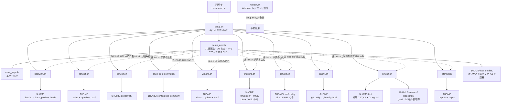
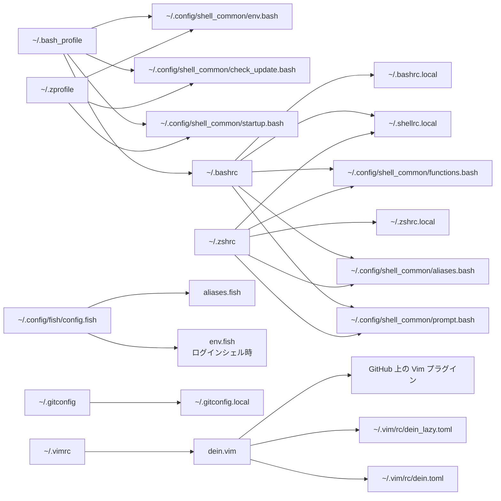

# リポジトリの関係図

このリポジトリは、ルートの `setup.sh` から各設定ディレクトリの初期化スクリプトを並列実行し、設定ファイルを `$HOME` 以下へ配置する構成になっている。

## セットアップ時の配置関係

実線は実行または配置、破線は読み込みや対象外の関係を表す。`setup.sh` は `windows/` を除く対象ディレクトリの `*.sh` を並列実行し、いずれかが失敗した場合は失敗したスクリプトを列挙して終了する。

## 配置後の読み込み関係

Bash と Zsh は `shell_common/` の配置物を共有する。追跡対象外の `*.local` ファイルは、端末固有のパス、環境変数、認証方式などを共有設定から分離するために使う。Fish は独立した設定ツリーを読み込み、Git は `.gitconfig.local`、Vim は `dein.vim` の TOML 定義をそれぞれ参照する。
